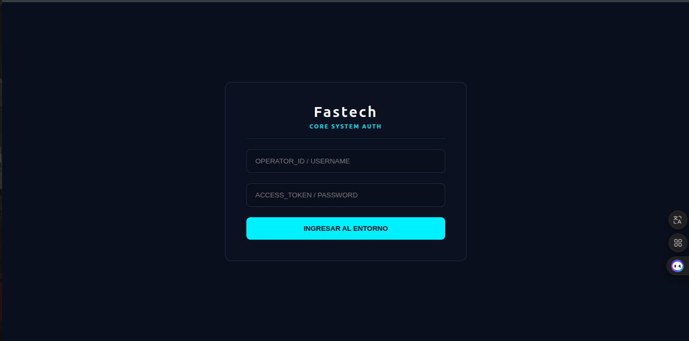
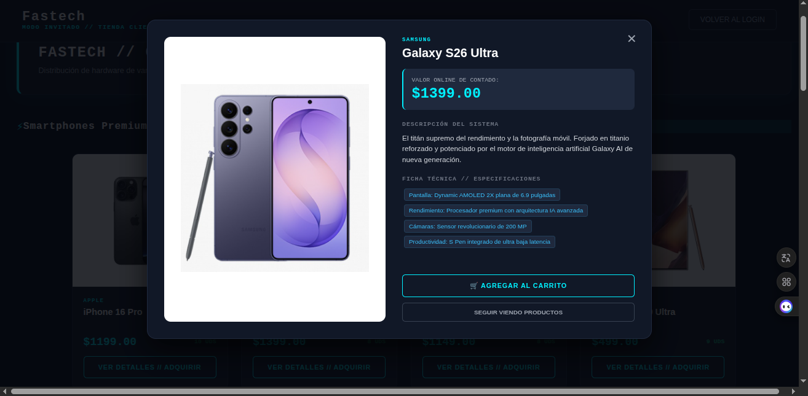
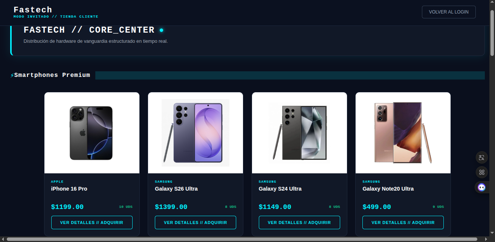
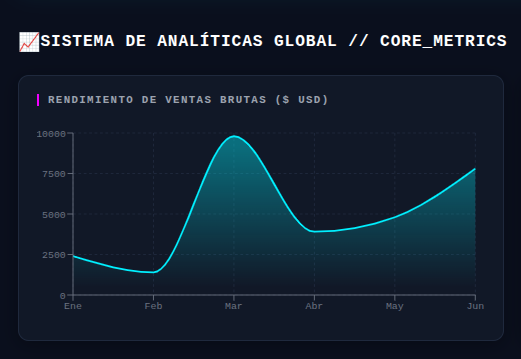
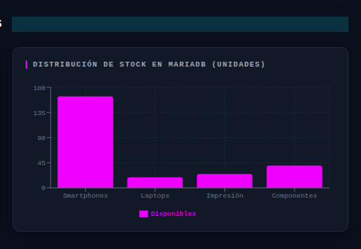
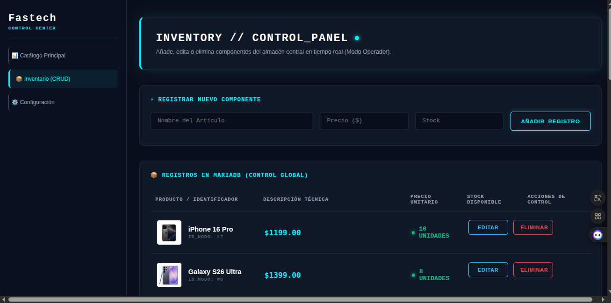
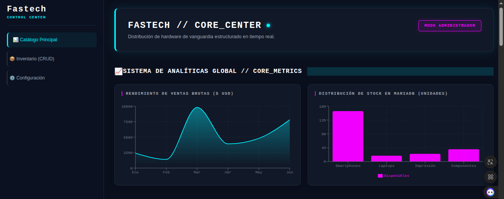
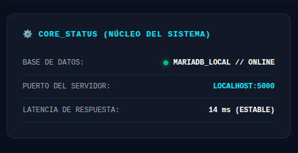
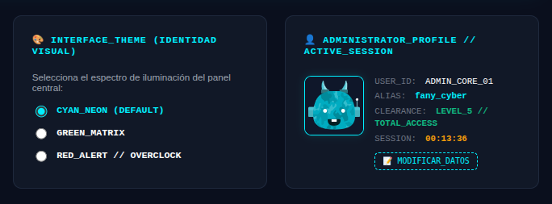
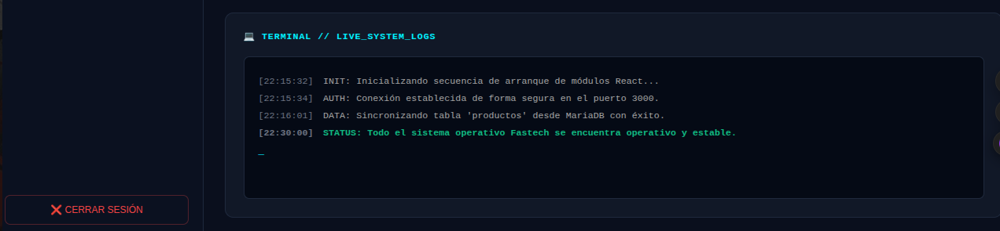

# 📊 Fastech // CENTRO DE CONTROL

<p align="center">
  
</p>

---

<h2 align="center">🌌 Descripción del Proyecto</h2>

<p align="justify">
Sistema avanzado e integrado para el control de inventario y monitoreo de infraestructura local. Diseñado con una interfaz cyberpunk optimizada para la administración de stock y la auditoría de procesos en tiempo real. Actúa de forma desacoplada para garantizar velocidad, consistencia de datos y un entorno visual de vanguardia.
</p>

---

<h2 align="center">🛠️ Características principales</h2>

* 📊 **Dashboard Central:** Métricas en tiempo real y análisis rápidas mediante gráficos dinámicos del flujo del sistema.
* 📦 **Control de Inventario:** CRUD functional, estricto e intuitivo para la gestión de productos, marcas y unidades disponibles.
* ⚙️ **Panel de Configuración:** Centro de mando interactivo para el control del núcleo del sistema y personalización visual dinámica de la interfaz.

---

<h2 align="center">📱 Módulos y Galería del Sistema</h2>

<h3 align="center">1. Módulo de Autenticación (Core System Auth)</h3>
<p align="justify">
Interfaz de acceso restringido que solicita credenciales cifradas (usuario y contraseña) para validar la identidad del operador antes de permitir el ingreso al panel de control superior, protegiendo la integridad de la persistencia de datos.
</p>

<p align="center"></p>

---

<h3 align="center">2. Entorno del Cliente // Catálogo Responsivo</h3>
<p align="justify">
Yo implementé la interfaz del catálogo público responsivo ("Modo Invitado // Tienda Cliente") optimizada bajo un espectro visual oscuro con acentos neón cian, diseñada específicamente para la exploración fluida de hardware tecnológico en tiempo real. En este módulo, estructuré una visualización en cuadrícula utilizando tarjetas dinámicas e independientes para renderizar la sección de Smartphones Premium, mapeando datos clave desde MariaDB como la marca, el modelo exacto del dispositivo, el precio unitario formateado y el stock crítico disponible en unidades (UDS). Asimismo, incorporé botones interactivos con bordes estilizados para la acción de "Ver Detalles // Adquirir" y un sistema de navegación superior con una pasarela de retorno seguro hacia el módulo de autenticación central (Volver al Login), demostrando la eficiencia técnica de React para manipular layouts limpios, modernos y completamente adaptables a las demandas visuales de la plataforma.
</p>

<p align="center"></p>

---

<h3 align="center">3. Panel de Operador Principal (Dashboard)</h3>
<p align="justify">
Consola central de administración con un menú lateral interactivo fluido, diseñado para que el usuario autenticado alterne rápidamente entre los diferentes entornos de control del sistema. Una vez superada la autenticación, el operador dispone de una suite central con un menú lateral fluido para alternar instantáneamente entre los diferentes entornos de control del sistema.
</p>

<p align="center"></p>

---

<h3 align="center">4. Sistema de Analíticas Globales // Flujo de Ventas</h3>
<p align="justify">
Componente visual estadístico integrado en el dashboard que representa el rendimiento comercial, auditoría de transacciones y el flujo de ingresos brutos del sistema mediante gráficos dinámicos en el frontend.
</p>

<p align="center"></p>

---

<h3 align="center">5. Sistema de Analíticas Globales // Distribución de Almacén</h3>
<p align="justify">
Gráfico estadístico interactivo que analiza el volumen físico y la distribución del stock de hardware en tiempo real, basándose directamente en los registros y consultas relacionales de MariaDB.
</p>

<p align="center"></p>

---

<h3 align="center">6. Gestión de Almacén (Inventory CRUD)</h3>
<p align="justify">
Formulario interactivo y suite de operaciones dedicada a ejecutar los procesos CRUD (crear, leer, actualizar y eliminar) en el stock físico de componentes informáticos, aplicando validaciones lógicas inmediatas para el registro seguro de nuevos componentes.
</p>

<p align="center"></p>

---

<h3 align="center">7. Visualización de Tablas Dinámicas</h3>
<p align="justify">
Interfaz estructurada en tablas limpias para listar el hardware guardado en el sistema. Muestra de forma ordenada todos los componentes informáticos recuperados en tiempo real desde MariaDB, permitiendo al operador monitorizar el stock disponible, códigos de barra y especificaciones técnicas de manera clara y centralizada.
</p>

<p align="center"></p>

---

<h3 align="center">8. Configuración del Núcleo (Core Status)</h3>
<p align="justify">
Módulo de diagnóstico técnico de infraestructura que reporta en tiempo real las métricas vitales del entorno local: el estado del motor de persistencia relacional (ONLINE), el puerto activo del backend (5000) y la latencia actual de red.
</p>

<p align="center"></p>

---

<h3 align="center">9. Perfil Operativo y Selección de Entorno</h3>
<p align="justify">
Panel de control de usuario que muestra las credenciales del operador en sesión, su nivel de autorización, el temporizador de sesión activa y la suite interactiva de selección de temas estéticos para la interfaz bajo el perfil de fany_cyber.
</p>

<p align="center"></p>

---

<h3 align="center">10. Auditoría de Procesos (Live System Logs)</h3>
<p align="justify">
Consola interactiva integrada directamente en la interfaz (cliente) que simula y renderiza en tiempo real las secuencias de arranque de los módulos, las confirmaciones de red del servidor, los registros de conexiones HTTP y la traza de actividad del entorno de ejecución.
</p>

<p align="center"></p>

---

<h2 align="center">🚀 Clonación del Proyecto</h2>

<p align="justify">
Para obtener una copia local de este repositorio, ejecuta el siguiente comando en tu terminal:
</p>

```bash
git clone [https://github.com/keniastefanyherr/Fastech.git](https://github.com/keniastefanyherr/Fastech.git)
